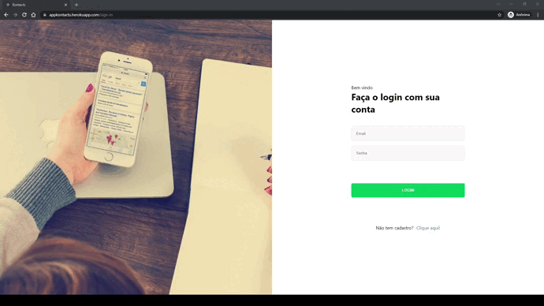

# Kontacts

<p>
Html | Css | JavaScript | React <br><br>
Single page em React utilizando hooks personalizados e próprios do React, Bibliotecas, requisições assíncronas com uso de token, API de contexto, roteamento de páginas, componentes estilizados e responsividade.
</p>

[Deploy](https://appkontacts.herokuapp.com/)<br>

<h2>📷 Preview</h2>



## Pré-requisitos

- [NodeJS](https://nodejs.org/en/download/)

## Passos para montar o ambiente local

1. Instalar o Yarn

```sh
npm install -g Yarn
```

3. Instalar dependências:

```sh
yarn install
```

4. Start da aplicação:

```sh
yarn start
```

5. Aplicação disponível em **http://localhost:3000**

Nesta aplicação 100% responsiva o usuário pode fazer um cadastro ou login e assim ter acesso a uma agenda de contatos online, o usuário também pode cadastrar, editar e excluir contatos.
